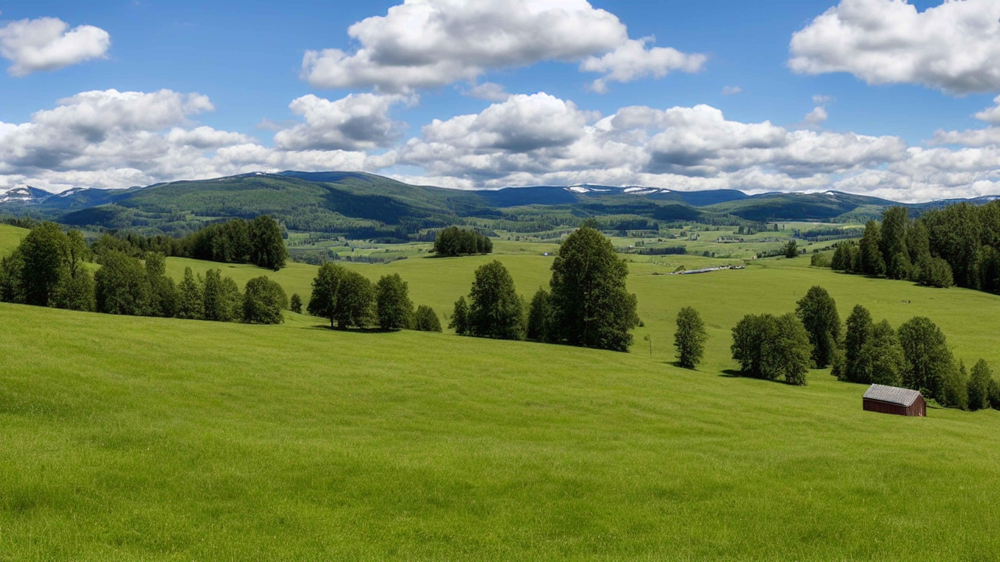

# Py Diffuser 02

**Py Diffuser 02** is a Windows desktop application for generating photorealistic images and short image-sequence videos with Stable Diffusion.

It uses a simple Tkinter interface and can optionally use a locally running Ollama model to expand short prompts into more descriptive photorealistic prompts.

<p align="center">
  
</p>

## Features

- Photorealistic Stable Diffusion generation
- 1280×720 base image generation
- Optional 4K Pillow upscale to 3840×2160
- Short MP4 generation from individually generated frames
- Optional image-to-image editing
- Optional local Ollama prompt enhancement
- Background generation threads so the UI remains responsive
- Progress reporting and generation logs
- Windows executable build with PyInstaller

## Project structure

```text
py_diffuser_02/
├── launcher.py
├── py_diffuser_02/
│   ├── __init__.py
│   ├── __main__.py
│   ├── config.py
│   ├── generator.py
│   ├── main.py
│   ├── model_manager.py
│   ├── ollama_client.py
│   └── ui.py
├── examples/
│   └── norway.png
├── output/
├── installer/
│   ├── build_installer.ps1
│   └── install_dependencies.ps1
├── requirements.txt
├── requirements-runtime.txt
├── .gitignore
└── README.md
```

## Requirements

- Windows 10/11
- Python 3.13 or newer for building/running from source
- A compatible PyTorch installation
- NVIDIA GPU with CUDA is strongly recommended for practical Stable Diffusion generation
- Ollama is optional; if enabled, the application expects a local Ollama server at `http://localhost:11434`

The first Stable Diffusion model load downloads the configured model from Hugging Face and may require several GB of storage.

## Run from source

Open PowerShell in the project directory:

```powershell
py -3.13 -m venv .venv
.venv\Scripts\Activate.ps1
python -m pip install --upgrade pip
python -m pip install -r requirements-runtime.txt
python -m py_diffuser_02
```

## Build the Windows executable

The project includes a PowerShell build script:

```powershell
powershell -ExecutionPolicy Bypass -File .\installer\build_installer.ps1
```

The script:

1. Requests administrator privileges.
2. Verifies Python 3.13+.
3. Creates/uses a local build environment.
4. Installs the runtime dependencies and PyInstaller.
5. Builds `py-diffuser-02.exe`.
6. Places the resulting executable in `dist/`.

### Important distinction

PyInstaller packages the Python runtime and Python libraries into the executable. It does **not** package the Stable Diffusion model weights into the executable.

The model is downloaded by Diffusers when the application first loads the configured model.

## Ollama

Ollama is not required for the Stable Diffusion engine itself. When enabled, it is used only to improve the user's prompt before generation.

If Ollama is unavailable, Py Diffuser 02 falls back to the original prompt instead of failing the generation request.

The configured model is:

```text
llama3
```

The Ollama endpoint is:

```text
http://localhost:11434/api/generate
```

## Output

Generated files are written to:

```text
output/
```

Image examples:

```text
pydiffuser02_photo_gen_3840x2160_20261001_173000.png
pydiffuser02_photo_edit_3840x2160_20261001_173500.png
```

Video examples:

```text
pydiffuser02_photo_video_512x512_12f_20261001_174000.mp4
```

## Architecture

The original single-file implementation has been separated into focused modules:

- `config.py` — generation settings and constants
- `model_manager.py` — Stable Diffusion pipeline loading
- `ollama_client.py` — optional prompt enhancement
- `generator.py` — image/video generation and file output
- `ui.py` — Tkinter desktop interface
- `main.py` — application orchestration
- `launcher.py` — root-level PyInstaller entry point

This keeps UI code separate from model and generation logic and makes future maintenance easier.

## Photorealistic-only design

This is designed specifically to create photorealistic imagery.

The application always:

1. Sends the prompt through the photorealistic Ollama instruction when Ollama is enabled.
2. Uses the photorealistic negative prompt during Stable Diffusion generation.
3. Names outputs using the `photo` suffix.

## Experimentation

Py Diffuser 02 is intended to be experimented with and modified.

The source code exposes generation parameters such as:

- Inference steps
- Guidance scale
- Image resolution
- Upscaling
- Image-to-image strength
- Video frame count
- Video frame rate
- Prompt enhancement settings

Experimenting with these values can produce substantially different results and is one of the reasons the source code is included alongside the Windows executable build process.

## License

This project is licensed under the MIT License. See the `LICENSE` file for details.

The MIT License applies to the Py Diffuser 02 source code itself. Stable Diffusion 1.5, Diffusers, PyTorch, Ollama, and other third-party components remain subject to their respective licenses and terms.
